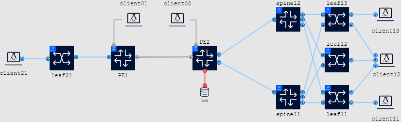

# Welcome at the Nokia Europe Partners DC Fabric Hackathon 2024!

This README is your starting point into the hackathon, it should get you familiar with the lab environment provided by Nokia, and provide an overview of the suggested sample activities.

During the day you will work in groups on any project that you are inspired to tackle or on one of the pre-provided activities of varying difficulty.

As long as you have a laptop with the ability to SSH we have example activities and a generic lab topology to help you progress if you don’t have something specific already in mind.   

Need help, not a problem, pop your hand in the air and an eager expert will be there to guide you. 

## Lab Environment
For this hackathon each group of participant(s) will receive their own dedicated VM running a copy of the generic lab topology.

If everything went according to plan, you should have received a physical piece of paper which contains:
- a group ID allocated to your group
- SSH credentials to the VM dedicated to your group. 
- HTTPS URL's towards this repo and access to a web based IDE in case you don't have one installed on your operating system.

> !!! Make sure to backup any code, config, ... <u> offline (e.g your laptop)</u>.
> The VM instances will not be accessible and will be destroyed once the hackathon is concluded.</p>

### Group ID

Please refer to the paper provided. If nothing has been provided, not a problem, pop your hand in the air and an eager expert will be there to allocate one for you. 

| Group ID | hostname instance |
| --- | --- |
| 1 | g1.dcfpartnerws.info |
| 2 | g2.dcfpartnerws.info |
| ... | ... |
| **X** | g**X**.dcfpartnerws.info |

### SSH

hostname: g**X**.dcfpartnerws.info

username: `refer to the paper provided or the slide presented`

password: `refer to the paper provided or the slide presented`

[Optional] To enable password-less access to an instance, use `ssh-keygen -h` to generate a public/private key pair and then `ssh-copy-id` to copy it over.

### WiFi

Details provided in the session.

### Activities & Topology

During this hackathon you can work on any problem/project you are inspired to tackle and/or on one of the pre-provided activities of varying difficulty. In comparison to last years' event we've spent effort aggregating (almost) all of the pre-provided activities on a single generic topology, so fewer time is lost on deploying various labs, allowing you to focus on the objective at hand.

#### Pre-provided activities

Below you can find a table with links towards those pre-provided project which you can use as a baseline for the problem/project you might want to tackle or perform the tasks we've set up for you.

Each pre-provided activity comes with a README of it's own, please click the pre-provided activities for more information.

| Link to pre-provided activity | NOS | Difficulty |
| --- | --- | --- |
| [CLI aliasing](./srlinux-b-cli-aliasing) | SR Linux | Basic |
| [Event handler](./srlinux-b-event-handler-backup) | SR Linux | Basic |
| [gNMIc](./srlinux-b-gnmic) | SR Linux | Basic |
| [gNOIc](./srlinux-b-gnoi) | SR Linux | Basic |
| [Logging](./srlinux-b-loki-logging) | SR Linux | Basic |
| [Streaming telemetry](./srlinux-b-streaming-telemetry) | SR Linux | Basic |
| [Configuration using Ansible intents](./srlinux-i-ansible-intent) | SR Linux | Intermediate |
| [Create a CLI plugin](./srlinux-i-cli-plugin-show-version) | SR Linux | Intermediate | 
| [Customize the CLI](./srlinux-v-custom-cli) | SR Linux | Advanced |
| [Using gNMI with Python](./srlinux-v-pygnmi) | SR Linux | Advanced |

#### Topology

When accessing your hackathon VM instance you'll see this repository has already been cloned for you and a fully configured network (powered by [containerlab](https://www.containerlab.dev)), including P/PE and datacentre nodes, is already available for you to use.

*Don't worry: This is your personal group network, you cannot impact any other groups.*



The above topology contains a number of functional blocks to help you in area's you might want to focus on, it contains:

- Routing:
  - SR-MPLS (Dual-Stack ISIS)
  - MP-BGP (SAFIs with IPv6 next-hop) ; single node (vRR) route-reflector
  - 2x P/PE-nodes (SR OS)
  - 1x route-reflector (SR OS) - collapsed into PE2
- Data Centers:
  - DC1: a CLOS model
    - 2x spines (spine11|spine12) and 3 leaf switches (leaf11|leaf12|leaf13)
  - DC2: a single leaf (leaf21) to demonstrate Data Center Interconnect usecases
  - IPv6 BGP unnumbered configured in the underlay
  - DCGW Integration:
    - DC1: PE2
    - DC2: PE1
  - a Data Center interconnect using a MPLS IP-VPN (EVPN/IPVPN integration):
    - VPRN "DCI" and EVPN/VPLS "IPVRF201" and EVPN/VPLS "IPVRF202"
- a fully working telemetry stack (gNMIc/prometheus/grafana + syslog/promtail/loki)
- Linux clients are attached to both the GRT and VPRN services allowing a full mesh of traffic. 

### Help! I've bricked my lab, how do I redeploy? 

When accessing your hackathon VM instance you'll see the DCF Partners Hackathon directory is a git clone of this repository.

If you have broken something and would like to restore the state without extensively troubleshooting, you can destroy and redeploy the command via following commands:

``` 
~$ cd $HOME/DCFPartnerHackathon/clab
~$ sudo clab destroy --cleanup --topo dcfpartnerws.clab.yml
~$ sudo clab deploy --reconfigure --topo dcfpartnerws.clab.yml
```

Or the equivalent short versions to save typing:
``` 
~$ cd $HOME/DCFPartnerHackathon/clab
~$ sudo clab des -c
~$ sudo clab dep -c
```
Remember that clab tries to find a .yml file in the current directory in case a topology file is not provided in the command line options.
In this lab, the proposed topology is described in a file called dcfpartnerws.clab.yml at $HOME/DCFPartnerHackathon/clab.

### Credentials & Access

#### Accessing the lab from within the VM

To access the lab nodes from within the VM, users should identify the names of the deployed nodes using the `sudo clab inspect -a` command:

```
sudo clab inspect -a
+----+-----------------------+--------------+------------------------------+--------------+------------------------------------+---------------+---------+----------------+--------------+
| #  |       Topo Path       |   Lab Name   |             Name             | Container ID |               Image                |     Kind      |  State  |  IPv4 Address  | IPv6 Address |
+----+-----------------------+--------------+------------------------------+--------------+------------------------------------+---------------+---------+----------------+--------------+
|  1 | dcfpartnerws.clab.yml | dcfpartnerws | clab-dcfpartnerws-client01   | 58a1bf782d0e | ghcr.io/srl-labs/network-multitool | linux         | running | 10.128.1.25/24 | N/A          |
|  2 |                       |              | clab-dcfpartnerws-client02   | df5372d9b8f6 | ghcr.io/srl-labs/network-multitool | linux         | running | 10.128.1.26/24 | N/A          |
|  3 |                       |              | clab-dcfpartnerws-client11   | 90179de11e55 | ghcr.io/srl-labs/network-multitool | linux         | running | 10.128.1.36/24 | N/A          |
|  4 |                       |              | clab-dcfpartnerws-client12   | 0c3021e5bdbd | ghcr.io/srl-labs/network-multitool | linux         | running | 10.128.1.37/24 | N/A          |
|  5 |                       |              | clab-dcfpartnerws-client13   | b9c8bca77ec1 | ghcr.io/srl-labs/network-multitool | linux         | running | 10.128.1.38/24 | N/A          |
|  6 |                       |              | clab-dcfpartnerws-client21   | 0c59fb5cfe14 | ghcr.io/srl-labs/network-multitool | linux         | running | 10.128.1.42/24 | N/A          |
|  7 |                       |              | clab-dcfpartnerws-dns        | 9d7dd9ade5b4 | ghcr.io/srl-labs/network-multitool | linux         | running | 10.128.1.15/24 | N/A          |
|  8 |                       |              | clab-dcfpartnerws-gnmic      | 0122d505bb35 | ghcr.io/openconfig/gnmic:0.36.2    | linux         | running | 10.128.1.71/24 | N/A          |
|  9 |                       |              | clab-dcfpartnerws-grafana    | c8f8f44c8917 | grafana/grafana:10.3.5             | linux         | running | 10.128.1.73/24 | N/A          |
| 10 |                       |              | clab-dcfpartnerws-leaf11     | da4d77529ada | ghcr.io/nokia/srlinux:24.3.2       | nokia_srlinux | running | 10.128.1.33/24 | N/A          |
| 11 |                       |              | clab-dcfpartnerws-leaf12     | 7ccc109bf094 | ghcr.io/nokia/srlinux:24.3.2       | nokia_srlinux | running | 10.128.1.34/24 | N/A          |
| 12 |                       |              | clab-dcfpartnerws-leaf13     | 0e04f81850f6 | ghcr.io/nokia/srlinux:24.3.2       | nokia_srlinux | running | 10.128.1.35/24 | N/A          |
| 13 |                       |              | clab-dcfpartnerws-leaf21     | 3a54429e0e8f | ghcr.io/nokia/srlinux:24.3.2       | nokia_srlinux | running | 10.128.1.41/24 | N/A          |
| 14 |                       |              | clab-dcfpartnerws-loki       | 3a8209af32a8 | grafana/loki:2.9.7                 | linux         | running | 10.128.1.76/24 | N/A          |
| 15 |                       |              | clab-dcfpartnerws-pe1        | cde558dc6a37 | vr-sros:24.3.R2                    | nokia_sros    | running | 10.128.1.21/24 | N/A          |
| 16 |                       |              | clab-dcfpartnerws-pe2        | 42eed39f1815 | vr-sros:24.3.R2                    | nokia_sros    | running | 10.128.1.22/24 | N/A          |
| 17 |                       |              | clab-dcfpartnerws-prometheus | 9d0ce758eb23 | prom/prometheus:v2.51.2            | linux         | running | 10.128.1.72/24 | N/A          |
| 18 |                       |              | clab-dcfpartnerws-promtail   | ddd5496e3374 | grafana/promtail:2.9.7             | linux         | running | 10.128.1.75/24 | N/A          |
| 19 |                       |              | clab-dcfpartnerws-spine11    | cb82313b68f8 | ghcr.io/nokia/srlinux:24.3.2       | nokia_srlinux | running | 10.128.1.31/24 | N/A          |
| 20 |                       |              | clab-dcfpartnerws-spine12    | d249372aa26f | ghcr.io/nokia/srlinux:24.3.2       | nokia_srlinux | running | 10.128.1.32/24 | N/A          |
| 21 |                       |              | clab-dcfpartnerws-syslog     | d94d689e81b1 | linuxserver/syslog-ng:4.5.0        | linux         | running | 10.128.1.74/24 | N/A          |
+----+-----------------------+--------------+------------------------------+--------------+------------------------------------+---------------+---------+----------------+--------------+
```

Using the names from the above output, we can login to a node using the following command:

For example to access node `clab-dcfpartnerws-leaf11` via ssh simply type:

```
ssh admin@clab-dcfpartnerws-leaf11
```

#### Accessing the lab via local WiFi connection

Each VM instance has a port-range (50000 - 51000) exposed. As lab nodes spin up, a public port is allocated by the docker daemon on the VM instance.
You can utilize those to access the lab services straight from your laptop.

With the `show-ports` command executed on a VM you get a list of mappings between external and internal ports allocated for each node of a lab:

```
~$ show-ports
NAMES                          PORTS
clab-dcfpartnerws-loki         3100/tcp
clab-dcfpartnerws-client12     80/tcp 443/tcp 1180/tcp 11443/tcp 50037->22/tcp [::]:50037->22/tcp
clab-dcfpartnerws-gnmic
clab-dcfpartnerws-grafana      3000->3000/tcp
clab-dcfpartnerws-syslog       6514/tcp 5514/udp 6601/tcp
clab-dcfpartnerws-client01     80/tcp 443/tcp 1180/tcp 11443/tcp 50025->22/tcp [::]:50025->22/tcp 
clab-dcfpartnerws-client13     80/tcp 443/tcp 1180/tcp 11443/tcp 50038->22/tcp [::]:50038->22/tcp
clab-dcfpartnerws-client11     80/tcp 443/tcp 1180/tcp 11443/tcp 50036->22/tcp [::]:50036->22/tcp
clab-dcfpartnerws-dns          80/tcp 443/tcp 1180/tcp 11443/tcp 50015->22/tcp [::]:50015->22/tcp
clab-dcfpartnerws-client21     80/tcp 443/tcp 1180/tcp 11443/tcp 50042->22/tcp [::]:50042->22/tcp
clab-dcfpartnerws-client02     80/tcp 443/tcp 1180/tcp 11443/tcp 50026->22/tcp [::]:50026->22/tcp
clab-dcfpartnerws-promtail
clab-dcfpartnerws-prometheus   9090->9090/tcp
clab-dcfpartnerws-leaf13       50035->22/tcp [::]:50035->22/tcp 50335->57400/tcp [::]:50335->57400/tcp
clab-dcfpartnerws-pe1          80/tcp 443/tcp 5000/tcp 10000-10099/tcp 161/udp 50021->22/tcp [::]:50021->22/tcp 50421->830/tcp [::]:50421->830/tcp 50321->57400/tcp [::]:50321->57400/tcp
clab-dcfpartnerws-leaf11       50033->22/tcp [::]:50033->22/tcp 50333->57400/tcp [::]:50333->57400/tcp
clab-dcfpartnerws-leaf12       50034->22/tcp [::]:50034->22/tcp 50334->57400/tcp [::]:50334->57400/tcp
clab-dcfpartnerws-leaf21       50041->22/tcp [::]:50041->22/tcp 50341->57400/tcp [::]:50341->57400/tcp
clab-dcfpartnerws-spine11      50031->22/tcp [::]:50031->22/tcp 50331->57400/tcp [::]:50331->57400/tcp
clab-dcfpartnerws-pe2          80/tcp 443/tcp 5000/tcp 10000-10099/tcp 161/udp 50022->22/tcp [::]:50022->22/tcp 50422->830/tcp [::]:50422->830/tcp 50322->57400/tcp [::]:50322->57400/tcp
clab-dcfpartnerws-spine12      50032->22/tcp [::]:50032->22/tcp 50332->57400/tcp [::]:50332->57400/tcp
```

Each service exposed on a lab node gets a unique external port number as per the table above. 
In the given case, Grafana's web interface is available on port 3000 of the VM which is mapped to Grafana's node internal port of 3000.

The following table shows common container internal ports and is meant to help you find the correct exposed port for the services.

| Service    | Internal Port number |
| ---------- | -------------------- |
| SSH        | 22                   |
| Netconf    | 830                  |
| gNMI       | 57400                |
| HTTP/HTTPS | 80/443               |
| Grafana    | 3000                 |

Subsequently you can access the lab node on the external port for your given instance using the DNS name of the assigned VM.

| Group ID | hostname instance |
| --- | --- |
| **X** | g**X**.dcfpartnerws.info |

In the example above, accessing `pe1` would be possible by: 

```
ssh -l admin gX.dcfpartnerws.info -p 50021
```

In the example above, accessing grafana would be possible browsing towards **http://X.dcfpartnerws.info:3000** (where X is the group ID you've been allocated)

[Optional] You can generate `ssh-config` using the `generate-ssh-config` command and store the output on your local laptop's SSH client, in order to connect directly to nodes.

#### Traffic generation: starting and stopping

In the generic topology, linux clients are attached to a number of routers:

- the PE layer
- the leafs in each data center
- in multiple VRFs: global routing table (grt) and vprn "dci" (vprn.dci)

To start the traffic on each client from the VM, you can use the `traffic.sh` script present in the `$HOME/DCFPartnerHackathon/clab` path:

```
~/DCFPartnerHackathon/clab$ ./traffic.sh
syntax: traffic CLIENT <start|stop> DESTINATION[.SUFFIX]
where:
    CLIENT is one of: [ client01 client02 client11 client12 client13 client21 ]
    DESTINATION is one of: [ all client01 client02 client11 client12 client13 client21 ]
    SUFFIX is one of: [ .grt .vprn.dci ]   -> if empty .grt will be considered
```

For example, to start traffic from client11 to all other clients in the topology, through the GRT (Global Routing Table), just try this:

```
~/DCFPartnerHackathon/clab$ ./traffic.sh client11 start all
starting traffic on client client11 to all
starting traffic to client01.grt, binding on client11.grt, saving logs to /tmp/client01.grt.log
starting traffic to client02.grt, binding on client11.grt, saving logs to /tmp/client02.grt.log
starting traffic to client12.grt, binding on client11.grt, saving logs to /tmp/client12.grt.log
starting traffic to client13.grt, binding on client11.grt, saving logs to /tmp/client13.grt.log
starting traffic to client21.grt, binding on client11.grt, saving logs to /tmp/client21.grt.log
```

Alternatively, one can start and/or stop traffic by connecting to the relevant client using SSH, and running `/traffic.sh`, for example:

```
ssh user@clab-dcfpartnerws-client11

client11:~$ /traffic.sh [-a <start|stop>] [-d <dns hostname>]
```

The dns hostname is composed out of the client name and a domain suffix.

| SSH | Client | Global Routing Table suffix | VPRN "DCI" suffix |
| --- | --- | --- | --- |
| clab-dcfpartnerws-client01 | client01 | .grt | .vprn.dci |
| clab-dcfpartnerws-client02 | client02 | .grt | .vprn.dci |
| clab-dcfpartnerws-client11 | client11 | .grt | .vprn.dci |
| clab-dcfpartnerws-client12 | client12 | .grt | .vprn.dci |
| clab-dcfpartnerws-client13 | client13 | .grt | .vprn.dci |
| clab-dcfpartnerws-client21 | client21 | .grt | .vprn.dci |

For example, if you'd like to start a unidirectional traffic flow from `client11` to `client21` in the global routing table:
```
client11:~$ /traffic.sh -a start -d client21.grt
starting traffic to client21.grt, binding on client11.grt, saving logs to /tmp/client21.grt.log
```

Stopping the traffic flow would be achieved by:

```
client11:~$ /traffic.sh -a stop -d client21.grt
stopping traffic to client21.grt
```

However, if you'd like to start a full mesh of traffic between `client11` and the rest of the clients, this could be achieved by executing: 

```
client11:~$ /traffic.sh -a start -d all.grt
starting traffic to client01.grt, binding on client11.grt, saving logs to /tmp/client01.grt.log
starting traffic to client02.grt, binding on client11.grt, saving logs to /tmp/client02.grt.log
starting traffic to client12.grt, binding on client11.grt, saving logs to /tmp/client12.grt.log
starting traffic to client13.grt, binding on client11.grt, saving logs to /tmp/client13.grt.log
starting traffic to client21.grt, binding on client11.grt, saving logs to /tmp/client21.grt.log

client11:~$ /traffic.sh -a stop -d all.grt
stopping traffic to client01.grt
stopping traffic to client02.grt
stopping traffic to client12.grt
stopping traffic to client13.grt
stopping traffic to client21.grt
```

## Cloning this repository

If you would like to work locally on your personal device you should clone this repository. This can be done using one of the following commands.

HTTPS:
```
git clone https://github.com/srlinuxeurope/DCFPartnerHackathon.git
```

SSH:
```
git clone git@github.com:srlinuxeurope/DCFPartnerHackathon.git
```

GitHub CLI:
```
gh repo clone srlinuxeurope/DCFPartnerHackathon
```

## Useful links

* [Network Developer Portal](https://network.developer.nokia.com/)
* [containerlab](https://containerlab.dev/)
* [gNMIc](https://gnmic.openconfig.net/)

### SR Linux

* [Learn SR Linux](https://learn.srlinux.dev/)
* [YANG Browser](https://yang.srlinux.dev/)
* [gNxI Browser](https://gnxi.srlinux.dev/)

### SR OS

* [SR OS Release 24.3](https://documentation.nokia.com/sr/24-3/index.html)
* [pySROS](https://network.developer.nokia.com/static/sr/learn/pysros/latest/index.html)
* [Network Developer Portal](https://network.developer.nokia.com/sr/learn/)

### Misc Tools/Software
#### Windows

* [WSL environment](https://learn.microsoft.com/en-us/windows/wsl/install)
* [Windows Terminal](https://apps.microsoft.com/store/detail/windows-terminal/9N0DX20HK701)
* [MobaXterm](https://mobaxterm.mobatek.net/download.html)
* [PuTTY Installer](https://the.earth.li/~sgtatham/putty/latest/w64/putty-64bit-0.78-installer.msi)
* [PuTTY Binary](https://the.earth.li/~sgtatham/putty/latest/w64/putty.exe)


#### MacOS

* [iTerm2](https://iterm2.com/downloads/stable/iTerm2-3_4_19.zip)
* [Warp](https://app.warp.dev/get_warp)
* [Hyper](https://hyper.is/)
* [Terminal](https://support.apple.com/en-gb/guide/terminal/apd5265185d-f365-44cb-8b09-71a064a42125/mac)

#### Linux

* [Gnome Console](https://apps.gnome.org/en/app/org.gnome.Console/)
* [Gnome Terminal](https://help.gnome.org/users/gnome-terminal/stable/)

#### IDEs

* [VS Code](https://code.visualstudio.com/Download)
* [VS Code Web](https://vscode.dev/)
* [Sublime Text](https://www.sublimetext.com/download)
* [IntelliJ IDEA](https://www.jetbrains.com/idea/download/)
* [Eclipse](https://www.eclipse.org/downloads/)
* [PyCharm](https://www.jetbrains.com/pycharm/download)
