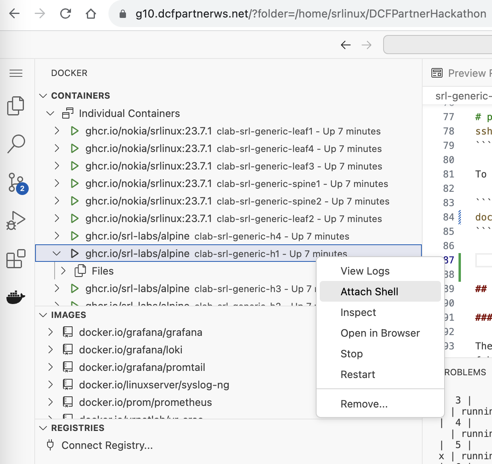

# Nokia SR Linux Generic Lab

Welcome to the generic SR Linux lab, where you will learn and experience Nokia's SR Linux network operating system.

In this lab you can:

- Deploy the pre-configured SR Linux fabric with workloads using [containerlab](https://containerlab.dev).
- Explore the underlay routing with eBGP and a typical BGP EVPN overlay setup leveraging Route Reflectors.
- Examine the IP-VRF and MAC-VRF network instances, VXLAN tunnels, and IRB interfaces.
- Verify VXLAN datapath by pinging between the hosts.
- And discover everything you want to know about SR Linux!

**Difficulty:** Beginner

## Topology

The lab represents a 2-Tier Clos data center fabric topology with four hosts.

The Leaf and Spine nodes are running containerized Nokia SR Linux (7220 IXR D3L) NOS and the hosts are based on Alpine Linux.

Topology diagram:


Every node in the data center fabric is configured with eBGP as an underlay routing protocol. iBGP is used to setup EVPN-based overlay layer 2 and layer 3 services.

Hosts are connected to the respective overlay services as per the diagram below:


## Deploying the lab

Deploy the topology with containerlab.

```bash
cd $HOME/DCFPartnerHackathon/srl-generic-lab
sudo containerlab deploy -c -t srl-generic.clab.yml
```

## Credentials & Access

Once the lab is running, you can access the network elements and hosts using the DNS name of a VM and the port numbers assigned to the respective services.

To get the list of ports allocated by containerlab:

```bash
# example of show-ports output
# note, that the port numbers can be different in your case
$ show-ports
NAMES                     PORTS
clab-srl-generic-leaf3    50021->22/tcp, 50021->22/tcp, 50020->80/tcp, 50020->80/tcp, 50018->57400/tcp, 50018->57400/tcp
clab-srl-generic-leaf4    50019->22/tcp, 50019->22/tcp, 50017->80/tcp, 50017->80/tcp, 50016->57400/tcp, 50016->57400/tcp
clab-srl-generic-h3       80/tcp, 443/tcp, 50008->22/tcp, 50008->22/tcp
clab-srl-generic-leaf1    50009->22/tcp, 50009->22/tcp, 50004->80/tcp, 50004->80/tcp, 50001->57400/tcp, 50001->57400/tcp
clab-srl-generic-spine1   50007->22/tcp, 50007->22/tcp, 50003->80/tcp, 50003->80/tcp, 50000->57400/tcp, 50000->57400/tcp
clab-srl-generic-h2       80/tcp, 443/tcp, 50013->22/tcp, 50013->22/tcp
clab-srl-generic-h4       80/tcp, 443/tcp, 50002->22/tcp, 50002->22/tcp
clab-srl-generic-leaf2    50014->22/tcp, 50014->22/tcp, 50010->80/tcp, 50010->80/tcp, 50005->57400/tcp, 50005->57400/tcp
clab-srl-generic-spine2   50015->22/tcp, 50015->22/tcp, 50012->80/tcp, 50012->80/tcp, 50006->57400/tcp, 50006->57400/tcp
clab-srl-generic-h1       80/tcp, 443/tcp, 50011->22/tcp, 50011->22/tcp

```

Each service exposed on a lab node gets a unique external port number as per the table above. For example, SSH of leaf1 is available on port `50009` of the VM and is mapped to leaf1's internal port of `22`.

Some well-known port numbers:

| Service | Internal Port number |
| ------- | -------------------- |
| SSH     | 22                   |
| gNMI    | 57400                |
| HTTP    | 80/443               |

Imagine you are assigned a VM with an address `g1.dcfpartnerws.net` and the `show-ports` command matches the output above; then you can access `leaf1` SSH via Internet with the following command:

```bash
# password: NokiaSrl1!
ssh -p 50009 admin@g1.dcfpartnerws.net
```

To access host h1:

```bash
docker exec -it clab-srl-generic-h1 bash
```

In alternative you can directly attach a shell session to the host h1 from the Docker Extension of your WEB based IDE:


## Exploring SR Linux

### Explore the underlay configuration

The role of the underlay routing is to distribute loopback prefixes across the leaf switches of our fabric. In this lab, we are using eBGP as the underlay routing protocol.


You can connect to nodes and check the interface configs, eBGP sessions state, AS numbers, and underlay network reachability between nodes by pinging the system IP addresses.

A list of helpful show commands:

- `show interface brief`
- `show interface ethernet-1/3*`
- `show network-instance summary`
- `show network-instance default route-table all`
- `show network-instance default protocols bgp neighbor`
- `show network-instance default protocols bgp neighbor 100.64.1.1 advertised-routes ipv4`
- `show network-instance default protocols bgp neighbor 100.64.1.1 received-routes ipv4`

`info` commands allow the retrieval of the configuration and state information from the respective datastores and provide full access to the system internals.

Getting information from the configuration datastore:

- `info interface ethernet-1/*`
- `info network-instance default`

And from the state datastore:

- `info from state interface ethernet-1/31 subinterface 1 statistics`
- `info from state network-instance default protocols bgp neighbor * received-messages`

### iBGP EVPN as Network Virtualization Overlay

EVPN uses MP-BGP as a control plane protocol between the tunnel endpoints. Typically, route-reflectors (RRs) are configured for the scalability. In this lab, spine routers are configured as RRs. All the leaf routers are peering with the spine routers for iBGP EVPN routes.


Connect to the spine nodes and check RR configuration and iBGP EVPN sessions across the data center fabric.

Some useful commands:

- `show network-instance default protocols bgp neighbor 10.0.0.5 advertised-routes evpn`
- `show network-instance default protocols bgp neighbor 10.0.0.5  received-routes evpn`
- `info network-instance default protocols bgp group ibgp-evpn`
- `info from state network-instance default protocols bgp neighbor 10.0.0.5 peer-type`

### MAC-VRFs & IP-VRFs with EVPN

MAC-VRFs are layer 2 EVPN instances usually mapped to a single broadcast domain and forward based on the mac-table.
IP-VRFs are layer 3 instances with IP routing tables. MAC-VRFs can bind to IP-VRFs using IRB interfaces.

Connect to the SR Linux nodes to check the EVPN service building blocks; IP-VRF and MAC-VRF configurations, VXLAN tunnel and IRB interfaces.

Have a look at the overlay topology and how different VRF types are mapped:


Some useful commands:

- `info network-instance ip-vrf-1`
- `info from state network-instance mac-vrf-1 protocols`
- `show network-instance mac-vrf-1 bridge-table mac-table all`
- `show network-instance ip-vrf-1 route-table all`
- `info tunnel-interface vxlan1 vxlan-interface *`
- `show tunnel-interface vxlan1 vxlan-interface * detail`
- `info interface irb1`
- `info interface ethernet-1/1*`
- `show network-instance default protocols bgp routes evpn route-type summary`

### Ping between hosts

With overlay services deployed, you can successfully test network reachability between the hosts.

Connect to the hosts and `ping` from:

- **h1 to h4** *(ping goes over mac-vrf-1)*

`sudo docker exec -it clab-srl-generic-h1 ping h4`

- **h1 to eth1 of h3** *(ping goes over ip-vrf-1)*

`sudo docker exec -it clab-srl-generic-h1 ping h3`

- **h2 to eth2 of h3** *(ping goes over ip-vrf-2)*

`sudo docker exec -it clab-srl-generic-h2 ping h3`

- **h3 to 100.100.100.100** *(ping an address on ip-vrf-1 and ip-vrf-2)*

`sudo docker exec -it clab-srl-generic-h3 ping 100.100.100.100`

Check the mac/ip table entries and EVPN route advertisements on the related SR Linux nodes with:

- `show network-instance mac-vrf-1 bridge-table mac-table all`
- `show network-instance ip-vrf-1 route-table all`
- `show network-instance default protocols bgp neighbor 10.0.0.5  received-routes evpn`
- `show network-instance default protocols bgp routes evpn route-type summary`
- `show network-instance default protocols bgp routes evpn route-type 2 detail`
- `show network-instance default tunnel-table ipv4`
- `show tunnel-interface vxlan1 vxlan-interface * detail`
- `info from state tunnel vxlan-tunnel vtep * statistics`

## References

- [SR Linux documentation](https://documentation.nokia.com/srlinux/)
- [Learn SR Linux](https://learn.srlinux.dev/)
