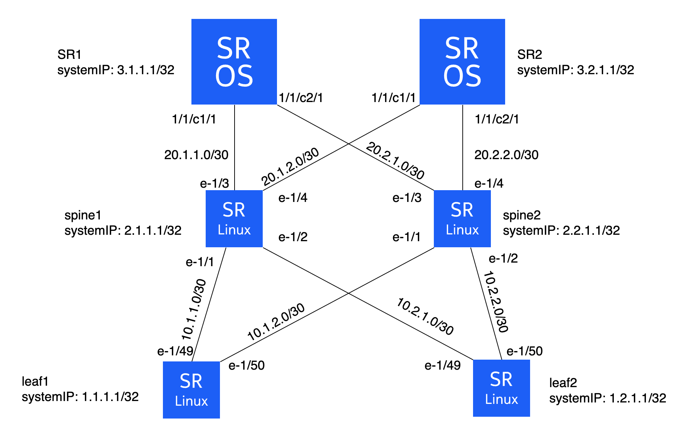

# SROS/SRL Configuration management using gNMI

The goal of this lab is to configure a network made of 4 SRL nodes and 2 SROS nodes using the gNMI interface.

**Grading: intermediate to Advanced**

## Deploying the lab

```shell
cd srl-sros-gnmi-config-lab
sudo clab deploy -c -t config.clab.yml
```



## Tools needed  

| Role | Software |
| --- | --- |
| Lab Emulation | [containerlab](https://containerlab.dev/) |
| Configuration and telemetry tool | [gNMIc](https://gnmic.openconfig.net/) |

## Introduction

* **Get familiar to gnmic CLI**

The starting point for most of the commands require passing node, username and pwd of the node being accessed, since we're not using encryption keys in this lab.

So, the CLI will always start like this:

`gnmic -a $node -u $username -p $password`

For lab purposes, we will also need to skip some security verifications. SROS and SR Linux OS requires different parameters:
| OS | Parameter |
| --- | --- |
| SROS | --insecure |
| SR Linux | --skip-verify |

So, the CLI will always start like this for SROS and SR Linux boxes, respectively:

```
gnmic -a $node -u $username -p $password --insecure
gnmic -a $node -u $username -p $password --skip-verify
```

By typing just `gnmic` a help text will be displayed.

But every command has its specific help by typing `gnmic $command --help` such as:

\- **get** and **set** are the main commands when you're dealing with node configuration.

\- **subscribe** is the command related to subscription to a given context.


* **Download SROS gNMI XPATHs**

```shell
git clone https://github.com/nokia/7x50_YangModels.git
cd 7x50_YangModels/latest_sros_23.7
gnmic generate path --dir ietf --file nokia-combined/nokia-conf.yang
```


## Tasks

- [ ] **Make sure the gNMI server of each node is up**

To check if the gNMI server is up on the nodes, use the command **capabilities**:
```
gnmic -a clab-config-sr1 -u admin -p admin --insecure capabilities
gnmic -a clab-config-leaf1 -u admin -p NokiaSrl1! --skip-verify capabilities
```

- [ ] **Provision ports in SR1 and SR2 - port connector**

XPATH: */configure/port[port-id=**X**]/connector*

```
gnmic -a clab-config-sr1 -u admin -p admin --insecure set --update-path /configure/port[port-id=1/1/c1]/connector/breakout --update-value c10-10g
```

- [ ] **Configure system IP addresses**

SROS XPATH: `/configure/router[router-name=Base]/interface`

SRL XPATH:  `/network-instance[name=default]/interface`

- [ ] **Configure subinterfaces in SRLs**

XPATH: `/interface[name=*]/subinterface[index=*]`

- [ ] **Add subinterfaces to the default network instance**

XPATH: `/network-instance[name=default]/interface`

- [ ] **Configure ports in SROS Base router**

XPATH: `/configure/router[router-name=*]/interface[interface-name=*]/port`

- [ ] **Configure IP addresses in all routers interfaces**

SROS XPATH: `/configure/router[router-name=Base]/interface[interface-name=*]/ipv4`

SRL  XPATH: `/interface[name=*]/subinterface[index=*]/ipv4`

- [ ] **Configure BGP in all routers**

SROS XPATH: `/configure/router[router-name=Base]/bgp`

SRL  XPATH: `/network-instance[name=default]/protocols/bgp`

- [ ] **Check that BGP peers are UP**

SROS XPATH: `/state/router[router-name=Base]/bgp`

SRL  XPATH: `/network-instance[name=default]/protocols/bgp`

- [ ] **Advanced: template all the configurations in a single set request file**

[gNMIc's set request template](https://gnmic.openconfig.net/cmd/set/#template-format)
